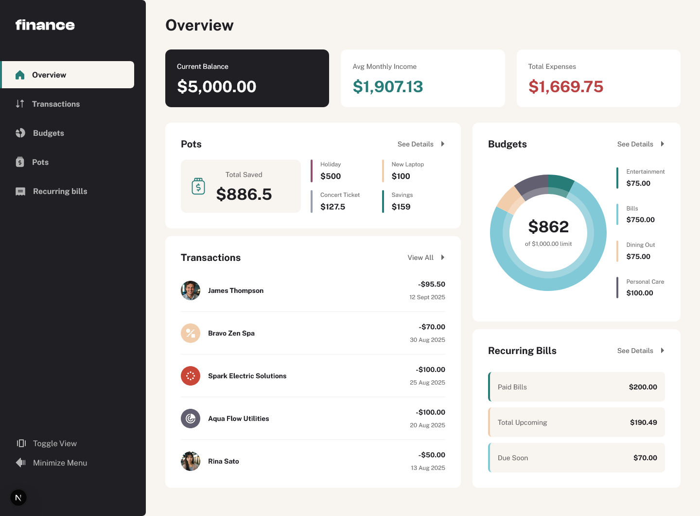
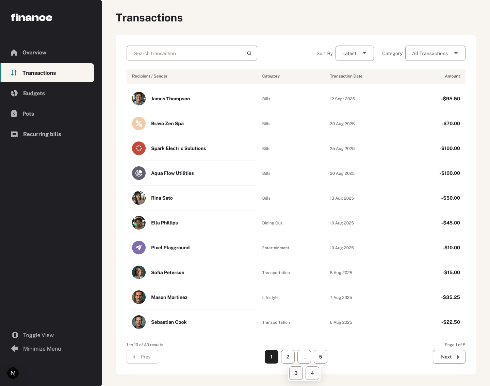
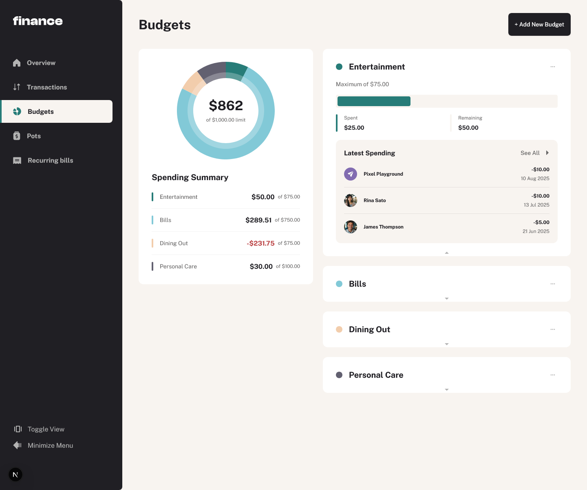
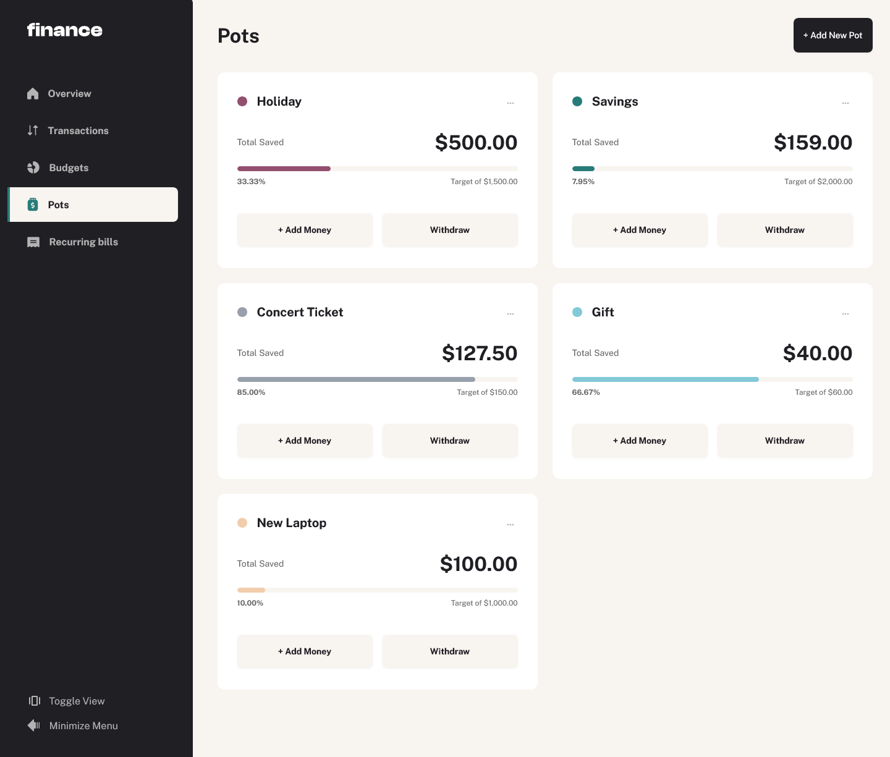
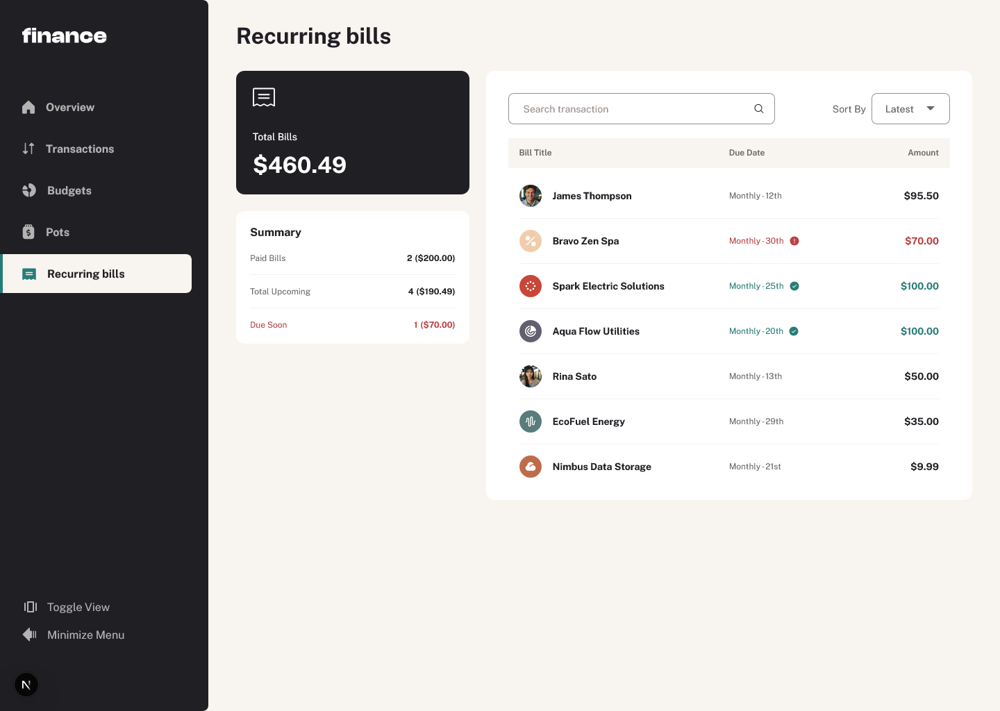

# Personal Finance App

A full‑stack personal finance dashboard built with Next.js App Router and MongoDB. Track transactions, budgets, pots (savings goals), and recurring bills with rich tables, charts, and keyboard‑accessible UI.

## Tech stack

- Next.js 15 (App Router) with React 19
- TypeScript
- Tailwind CSS v4 + tw-animate-css
- Radix UI primitives
- TanStack Table v8 (data table, sorting, filtering, pagination)
- Recharts (charts)
- MongoDB Node.js Driver v6
- Zod (runtime env validation)
- SVGR for importing SVGs as React components
- ESLint + Prettier (with Tailwind plugin)

## Features

- Overview page summarizing balances, spending, categories, and charts
- Transactions with search, sort, filtering, and pagination
- Budgets CRUD (create/update/delete), with spend vs limit and category themes
- Pots (savings goals) with add/withdraw actions and progress tracking
- Recurring Bills summary with Paid/Upcoming/Due Soon logic for the current cycle (monthly)
- Optimized data fetching via next/cache + tag-based revalidation
- Keyboard‑navigable components and responsive layout

## Project structure (high level)

- src/app/(dashboard)/…: overview, transactions, budgets, pots, bills
- src/app/(dashboard)/shared-data: DB-backed data access for each area
- src/app/(dashboard)/budgets/\_actions: server actions for budgets CRUD
- src/lib: db connection, caching helpers, config, types, utilities
- src/components: UI components (tables, charts, dialogs, inputs, etc.)

## Prerequisites

- Node.js 18.18+ (or 20+)
- MongoDB database (local or hosted)

## Environment variables

Create a .env file in the project root with:

- MONGODB_URI: your MongoDB connection string
- MONGODB_NAME: the database name

The variables are validated at runtime using Zod (see src/lib/load-env.ts). Missing values will throw on boot.

## Install and run

Using pnpm (recommended):

- pnpm install
- pnpm dev

Using npm:

- npm install
- npm run dev

Build and start production server:

- pnpm build && pnpm start

Other scripts:

- pnpm lint – run ESLint
- pnpm prettier – format with Prettier

## Data model (MongoDB collections)

The app expects these collections and shapes (see src/lib/types.ts):

```ts
- balances: { current: number, income: number, expenses: number }
- transactions: {
  - avatar: string
  - name: string
  - category: one of filterCategories in src/lib/config.ts (e.g., "Bills", "Groceries", ...)
  - date: ISO date string (YYYY-MM-DD)
  - amount: number (negative for expenses, positive for income)
  - recurring: boolean
    }
- budgets: { category: TransactionCategory, maximum: number, theme: CSS var string }
- pots: { name: string, target: number, total: number, theme: CSS var string }
```

## Styling

- Tailwind CSS v4 is used
- Design custom tokens (CSS variables) define theme, chart colors, and sidebar palette.

## Screenshots







## Deployment

- Set MONGODB_URI and MONGODB_NAME in your hosting provider’s environment settings.
- Build with next build and run with next start (or your host’s adapter).
- Ensure your MongoDB IP access list allows your host to connect.

## License

Licensed under the MIT License. See the [LICENSE](LICENSE) file for details.

## Author

- This project was developed by Ahmad Yousif.

- [Frontend Mentor](https://frontendmentor.io/profile/AhmadYousif89)
- [GitHub](https://github.com/AhmadYousif89)
